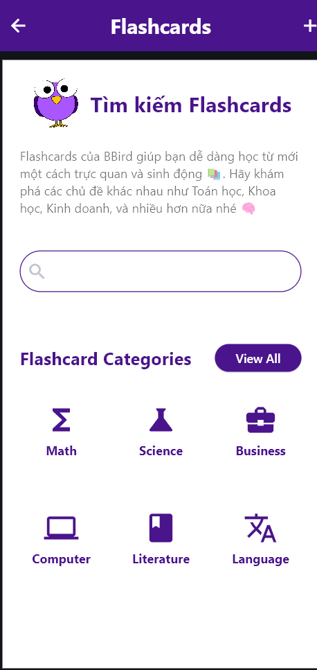
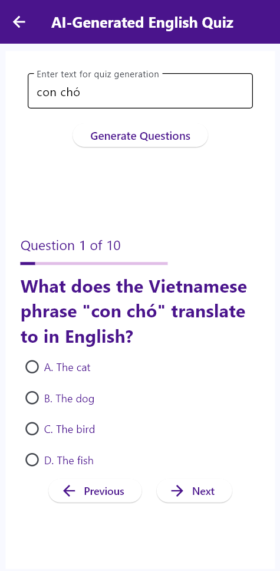

# 📚 BBird - AI Flashcards App 🤖

**BBird** is an AI-integrated flashcards application designed to enhance the learning experience by leveraging artificial intelligence. With BBird, users can create and manage flashcards, have quizzes automatically generated by AI, interact with an AI tutor, and play vocabulary memory games. The app aims to make learning more engaging, personalized, and efficient.

## Features ✨

- **Smart Flashcards** 📋: Easily create and organize flashcards with various types of content.
  


- **AI-Generated Quizzes** 🧠: Automatically generate quizzes based on your flashcards to test your knowledge and improve retention.
  


- **AI Tutor** 🗣️: Interact with an AI tutor to ask questions, get explanations, and have guided learning sessions.
  


- **Vocabulary Memory Games** 🎮: Play fun and interactive games designed to help you remember vocabulary more effectively.
  


## Installation 🛠️

1. Clone the repository:
    ```bash
    git clone https://github.com/username/BBird-AI-Flashcards-App.git
    cd BBird-AI-Flashcards-App
    ```

2. Install dependencies:
    ```bash
    pip install -r requirements.txt
    ```

3. Run the application:
    ```bash
    python main.py
    ```

## Contribution 🤝

We welcome contributions from the community. If you would like to contribute to this project, please follow these steps:

1. Fork this repository.
2. Create a new branch for your feature (`git checkout -b feature/AmazingFeature`).
3. Commit your changes (`git commit -m 'Add some AmazingFeature'`).
4. Push the branch to GitHub (`git push origin feature/AmazingFeature`).
5. Create a Pull Request.

## Contact 📧

If you have any questions, please contact us at: support@bbird.com.
